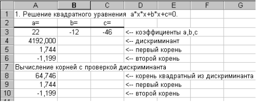
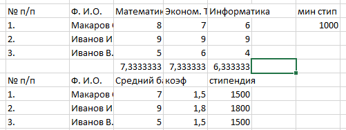
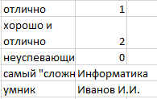

# Лабораторная работа №3_3. Логические переменные и функции.

| Number | Task | Screenshot |
|:------:|:----------|----------|
| 1 | Составьте электронную таблицу для решения уравнения | |
| 2 | Составить электронную таблицу, определяющую стипендию по правилу |  |
| 3 | По результатам сдачи сессии группой студентов определить |  |
